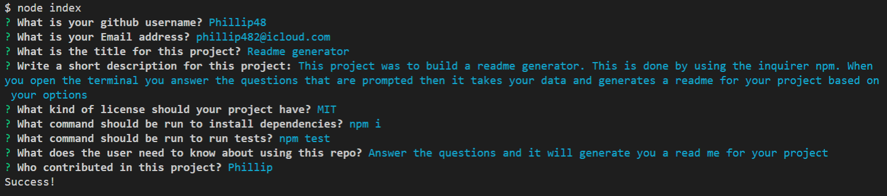

# Readme generator  
  
  
## Table of contents   
-[Description](#Description)  
-[User-Knowledge](#User-needs-to-know:)  
-[Images](#Images)  
-[Contributors](#Contributors)  

## Description  
This project was to build a readme generator. This is done by using the inquirer npm. When you open the terminal you answer the questions that are prompted then it takes your data and generates a readme for your project based on your options.

## User needs to know:  
Answer the prompted questions and it will generate you a readme for you project

### Images  
  

### Installation   
git clone git@github.com:Phillip48/Read.md-Generator.git  

## Contact Me  
Github: Phillip48  
Email: phillip482@icloud.com  

## Contributors  
Phillip  

  